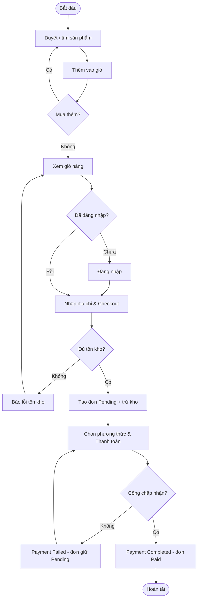
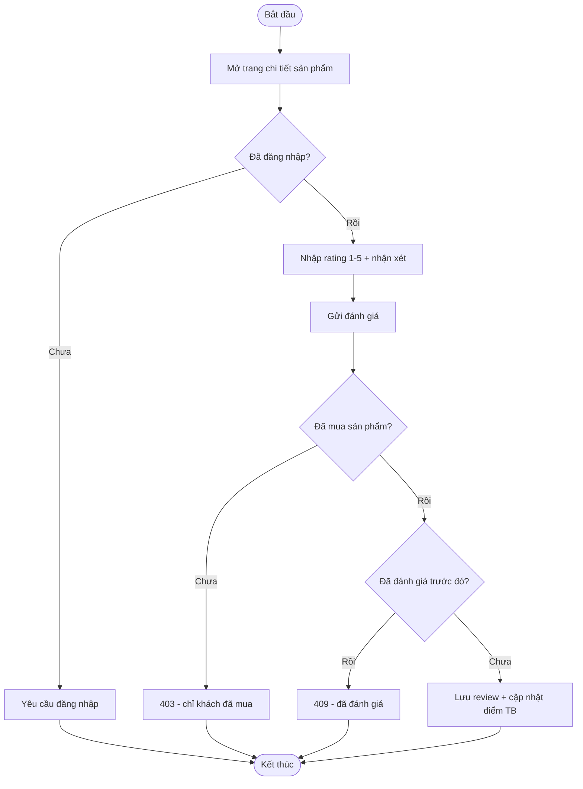
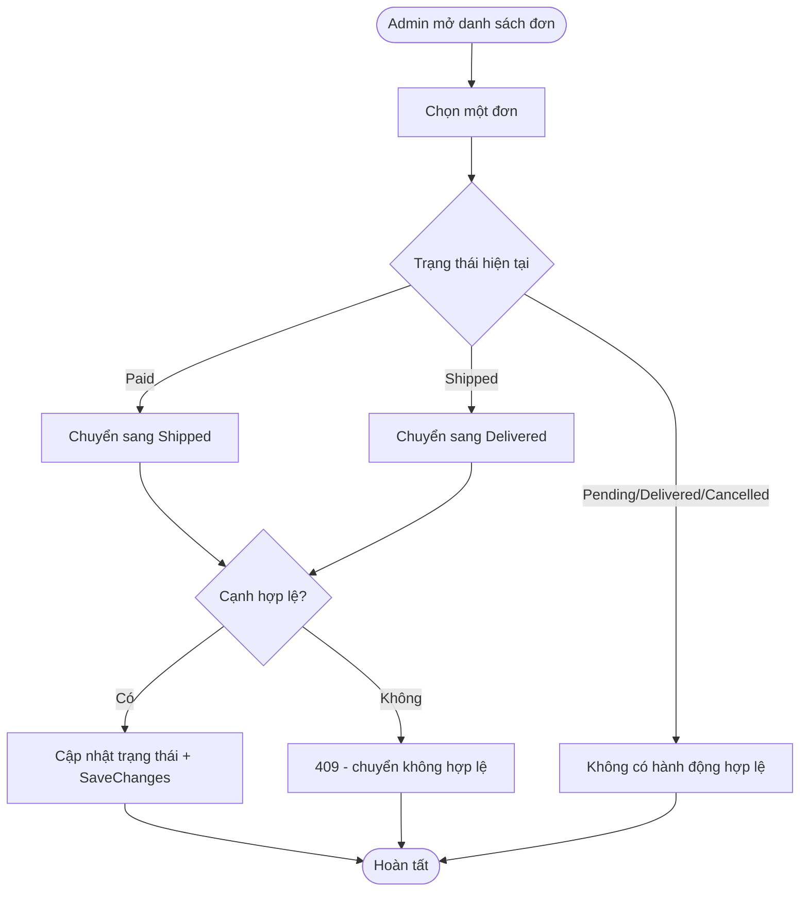

# Activity Diagrams — MiniShop

## 1. Luồng mua hàng (Checkout + Payment)

```mermaid
flowchart TD
    Start([Bắt đầu]) --> Browse[Duyệt / tìm sản phẩm]
    Browse --> Add[Thêm vào giỏ]
    Add --> More{Mua thêm?}
    More -->|Có| Browse
    More -->|Không| ViewCart[Xem giỏ hàng]
    ViewCart --> Login{Đã đăng nhập?}
    Login -->|Chưa| DoLogin[Đăng nhập]
    DoLogin --> Checkout
    Login -->|Rồi| Checkout[Nhập địa chỉ & Checkout]
    Checkout --> Stock{Đủ tồn kho?}
    Stock -->|Không| StockErr[Báo lỗi tồn kho]
    StockErr --> ViewCart
    Stock -->|Có| CreateOrder[Tạo đơn Pending + trừ kho]
    CreateOrder --> Pay[Chọn phương thức & Thanh toán]
    Pay --> Charge{Cổng chấp nhận?}
    Charge -->|Không| PayFail[Payment Failed - đơn giữ Pending]
    PayFail --> Pay
    Charge -->|Có| Paid[Payment Completed - đơn Paid]
    Paid --> End([Hoàn tất])
```

## 2. Luồng đánh giá sản phẩm (Review)

```mermaid
flowchart TD
    Start([Bắt đầu]) --> Open[Mở trang chi tiết sản phẩm]
    Open --> Auth{Đã đăng nhập?}
    Auth -->|Chưa| Prompt[Yêu cầu đăng nhập]
    Prompt --> End
    Auth -->|Rồi| Fill[Nhập rating 1-5 + nhận xét]
    Fill --> Submit[Gửi đánh giá]
    Submit --> Bought{Đã mua sản phẩm?}
    Bought -->|Chưa| Forbid[403 - chỉ khách đã mua]
    Forbid --> End
    Bought -->|Rồi| Dup{Đã đánh giá trước đó?}
    Dup -->|Rồi| Conflict[409 - đã đánh giá]
    Conflict --> End
    Dup -->|Chưa| Save[Lưu review + cập nhật điểm TB]
    Save --> End([Kết thúc])
```

## 3. Luồng xử lý đơn của Admin

```mermaid
flowchart TD
    Start([Admin mở danh sách đơn]) --> Pick[Chọn một đơn]
    Pick --> Cur{Trạng thái hiện tại}
    Cur -->|Paid| ToShip[Chuyển sang Shipped]
    Cur -->|Shipped| ToDeliver[Chuyển sang Delivered]
    Cur -->|Pending/Delivered/Cancelled| NoAction[Không có hành động hợp lệ]
    ToShip --> Validate{Cạnh hợp lệ?}
    ToDeliver --> Validate
    Validate -->|Có| Update[Cập nhật trạng thái + SaveChanges]
    Validate -->|Không| Reject[409 - chuyển không hợp lệ]
    Update --> End([Hoàn tất])
    Reject --> End
    NoAction --> End
```
