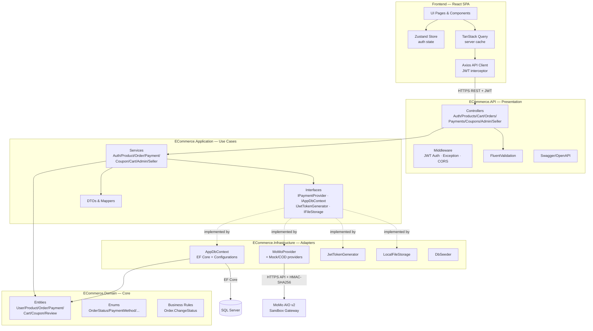
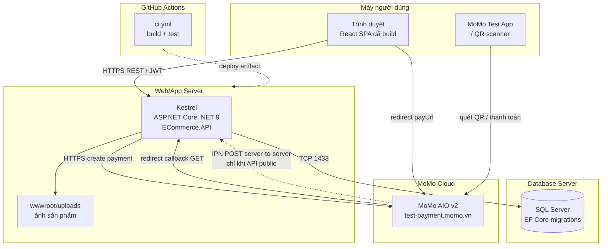

# Component & Deployment Diagram — MiniShop

Tài liệu mô tả kiến trúc phần mềm (Component) và cách triển khai (Deployment) của hệ thống MiniShop.

## 1. Component Diagram

Backend theo **Clean Architecture** — phụ thuộc hướng vào trong: `API → Application → Domain`, `Infrastructure → Application/Domain`. Domain là lõi thuần, không phụ thuộc gì.

**Nguyên tắc phụ thuộc (Dependency Inversion):** `Application` khai báo interface (vd `IPaymentProvider`, `IAppDbContext`), `Infrastructure` cài đặt. DI container ở `API/Program.cs` bind chúng lúc khởi động → tầng use-case không biết chi tiết EF Core hay MoMo, dễ test và thay thế.

## 2. Deployment Diagram

Mô tả các node vật lý/logic khi chạy. Ở môi trường dev, frontend và backend chạy tách port; production gợi ý reverse-proxy + object storage.

### Ghi chú triển khai

| Node | Dev (hiện tại) | Production (gợi ý) |
|------|----------------|--------------------|
| Frontend | Vite dev server `:5173` | Build tĩnh, serve qua CDN / reverse-proxy (Nginx) |
| Backend | Kestrel `:5215` | Kestrel sau Nginx/IIS, HTTPS + domain thật |
| Database | SQL Server local | SQL Server managed (Azure SQL) |
| File upload | `wwwroot/uploads` local disk | Object storage (S3 / Azure Blob) |
| MoMo | Sandbox, test credentials công khai | Merchant key thật, API public để nhận IPN |

> **IPN trên dev:** MoMo gọi IPN server-to-server tới `ipnUrl`. Trên `localhost`, MoMo cloud không truy cập được nên IPN không tới — đơn được chốt qua **redirect callback** (trình duyệt khách tự gọi `localhost`). Khi deploy public (hoặc dùng ngrok), IPN mới hoạt động và trở thành đường xác nhận chính (đáng tin hơn redirect vì không phụ thuộc khách quay lại).
