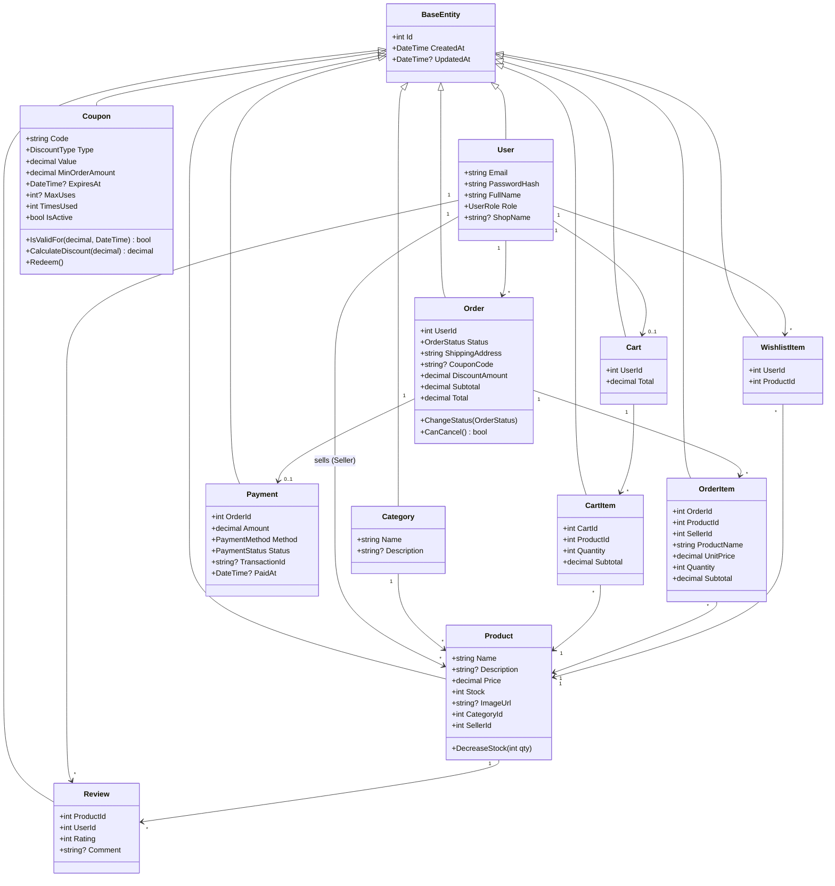
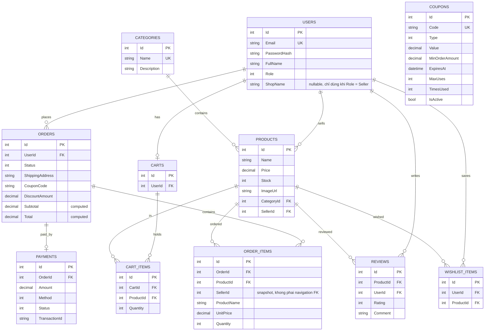

# Class Diagram & ERD — MiniShop

## 1. Class Diagram (Domain Entities)

> `User.Products` là navigation phía Seller (một User có `Role = Seller` sở hữu nhiều Product qua `Product.SellerId`). `OrderItem.SellerId` không phải navigation, chỉ là snapshot int (không có association tới User trong sơ đồ) — giữ lại seller tại thời điểm bán dù sản phẩm/seller sau đó đổi.

## 2. Entity Relationship Diagram (ERD)

> `Coupon` không có FK/quan hệ tới bảng khác — `Orders.CouponCode` chỉ là snapshot string, không tham chiếu khóa ngoại tới `Coupons.Code`.

## 3. Ràng buộc & index quan trọng
- `Users.Email` — unique index.
- `Categories.Name` — unique index.
- `CartItems(CartId, ProductId)` — unique (mỗi SP một dòng/giỏ).
- `Reviews(ProductId, UserId)` — unique (một đánh giá/SP/khách).
- `WishlistItems(UserId, ProductId)` — unique.
- `OrderItems` lưu **snapshot** `ProductName` + `UnitPrice` để giữ lịch sử khi giá/sản phẩm đổi.
- Xóa Category bị chặn nếu còn Product (DeleteBehavior.Restrict).
- `Coupons.Code` — unique index.
- `Orders.CouponCode` là snapshot string, không phải FK tới `Coupons`.
- `Orders.Subtotal` / `Orders.Total` là computed property (không lưu cột riêng): `Subtotal = Σ Items.Subtotal`, `Total = Max(0, Subtotal - DiscountAmount)`.
- `Products.SellerId` — FK tới `Users`, có index (phục vụ lọc theo `sellerId` trong search + truy vấn dashboard/orders theo seller).
- `OrderItems.SellerId` — không phải FK (chỉ là snapshot int, không có navigation tới `Users`), nhưng có index để truy vấn nhanh "đơn/doanh thu của seller X" (`DashboardService`, `SellerOrderService`).
- **Ràng buộc ở tầng application (không phải DB constraint):** một Seller chỉ được sửa/xóa sản phẩm có `Product.SellerId == currentUserId`; Admin không bị ràng buộc này. Kiểm tra thực hiện trong `ProductService.UpdateAsync`/`DeleteAsync` (tham số `actorId`, `isAdmin`), không khớp → trả lỗi Forbidden (403).
- Khi tạo sản phẩm (`ProductService.CreateAsync`), `SellerId` luôn được gán bằng id của người gọi (`sellerId` tham số) — client không thể tự chọn seller khác.
