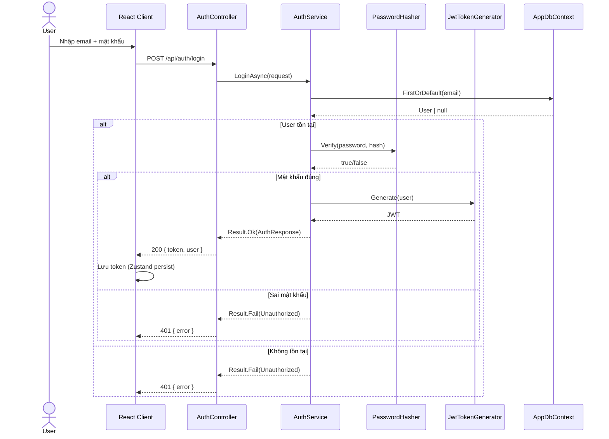
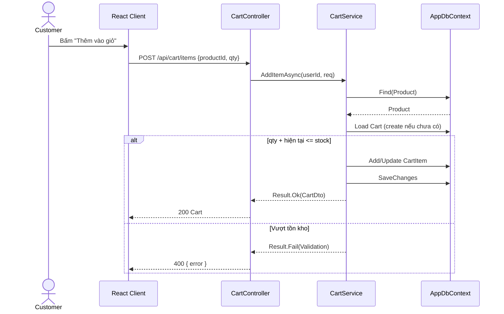
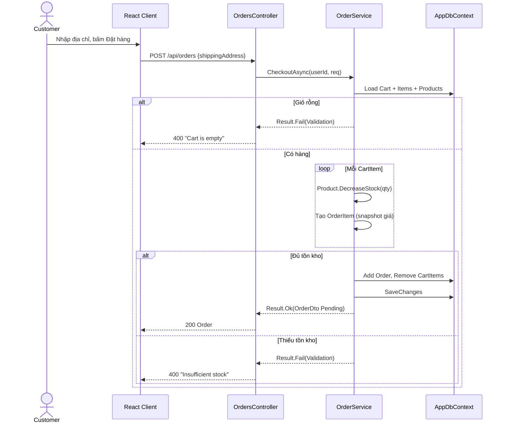
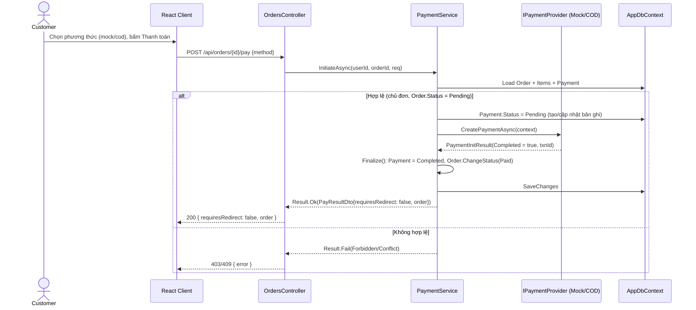
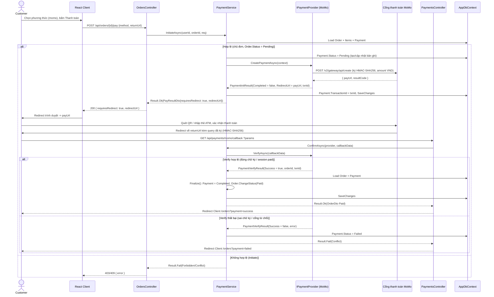

# Sequence Diagrams — MiniShop

Các sơ đồ tuần tự cho luồng nghiệp vụ chính. Lớp tham chiếu: Controller → Service → DbContext/Gateway.

## 1. Đăng nhập (Login)

## 2. Thêm vào giỏ (Add to Cart)

## 3. Đặt hàng (Checkout)

> Nếu request kèm `CouponCode`, `CheckoutAsync` validate coupon (còn hiệu lực, đủ điều kiện đơn tối thiểu) và set `Order.DiscountAmount` trước khi lưu — không phải một lệnh gọi riêng.

## 4a. Thanh toán tức thời (Mock / COD)

Áp dụng khi `IPaymentProvider.CreatePaymentAsync` trả `Completed = true` ngay (Mock, COD — không cần redirect ra cổng ngoài).

## 4b. Thanh toán qua redirect (MoMo)

Áp dụng khi `CreatePaymentAsync` trả `RedirectUrl` (payment vẫn `Pending`). Việc xác nhận thật sự diễn ra sau, khi cổng gọi lại callback endpoint.

