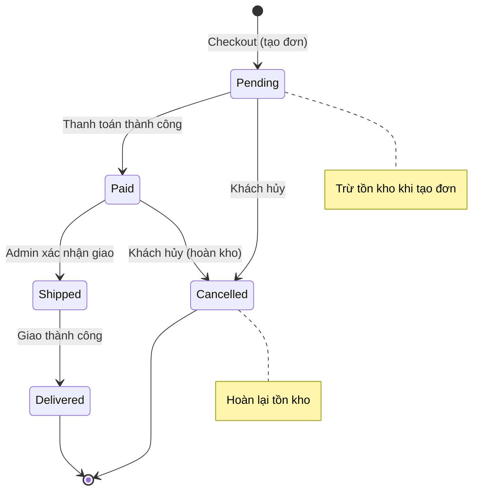
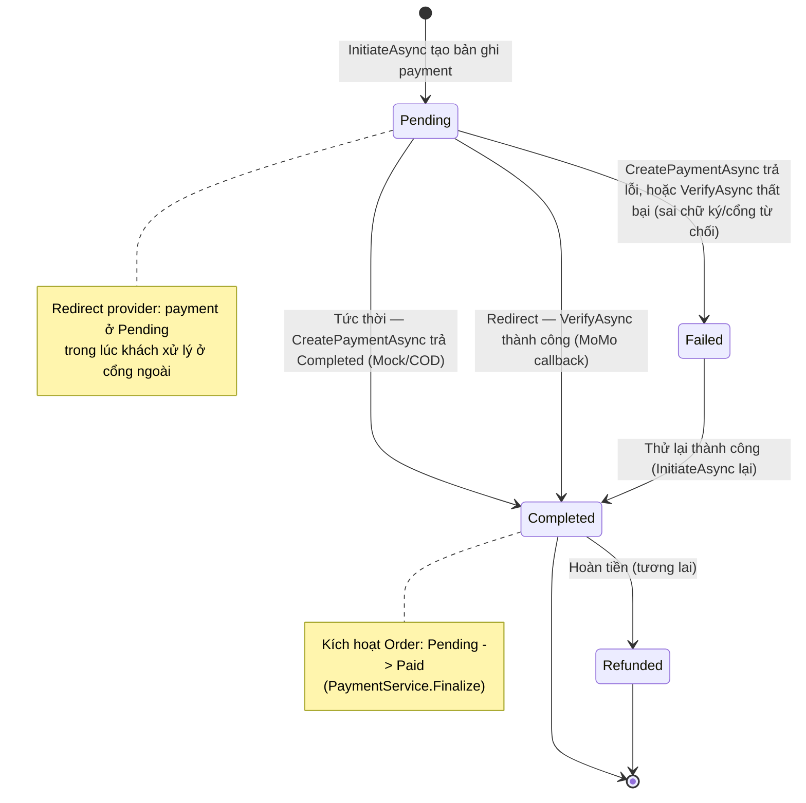
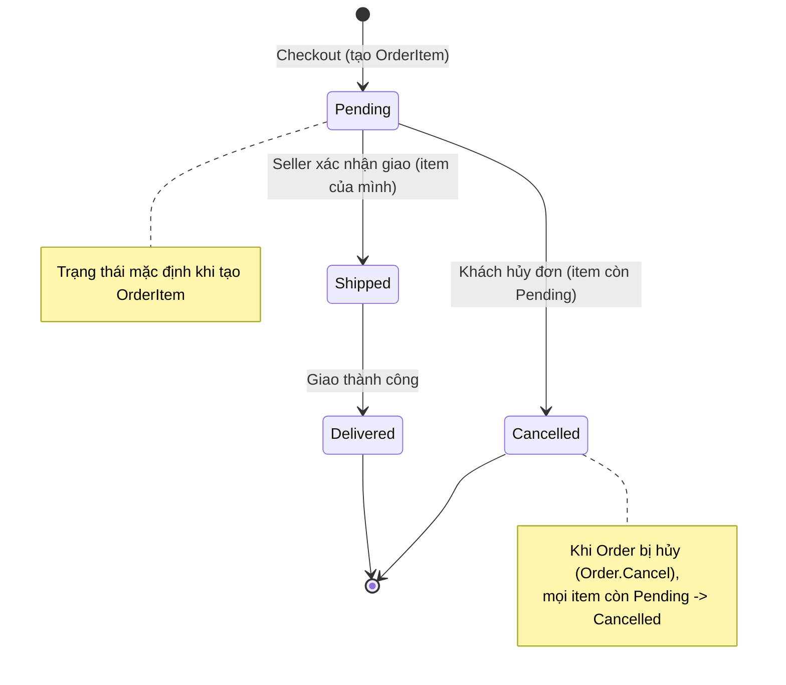

# State Machine Diagrams — MiniShop

## 1. Vòng đời Đơn hàng (Order)

Quy tắc cài đặt trong `Order.ChangeStatus()` (Domain layer). Mọi chuyển trạng thái ngoài các cạnh dưới đây bị từ chối (`InvalidOrderTransitionException` → HTTP 409).

**Bảng chuyển trạng thái hợp lệ:**

| Từ \ Đến | Pending | Paid | Shipped | Delivered | Cancelled |
|----------|:-------:|:----:|:-------:|:---------:|:---------:|
| Pending  | — | ✅ | ❌ | ❌ | ✅ |
| Paid     | ❌ | — | ✅ | ❌ | ✅ |
| Shipped  | ❌ | ❌ | — | ✅ | ❌ |
| Delivered| ❌ | ❌ | ❌ | — | ❌ |
| Cancelled| ❌ | ❌ | ❌ | ❌ | — |

> Delivered và Cancelled là trạng thái cuối (không có cạnh ra).

## 2. Vòng đời Thanh toán (Payment)

Cài đặt trong `PaymentService.InitiateAsync` / `ConfirmAsync` qua `IPaymentProvider` (Mock, COD, MoMo). Có 2 kiểu provider:
- **Tức thời** (Mock, COD): `CreatePaymentAsync` trả `Completed = true` ngay trong `InitiateAsync` → không có bước redirect/callback.
- **Redirect** (MoMo): `CreatePaymentAsync` gọi API MoMo tạo giao dịch, trả `RedirectUrl` (payUrl), payment giữ `Pending` cho tới khi cổng gọi lại `GET /api/payments/momo/callback` (hoặc IPN `POST /api/payments/momo/ipn`) → `ConfirmAsync` gọi `VerifyAsync` (kiểm tra chữ ký HMAC-SHA256) để chốt kết quả.

> `Refunded` được mô hình hóa trong enum cho khả năng mở rộng; luồng hoàn tiền chưa nằm trong phạm vi hiện tại.

## 3. Vòng đời Giao hàng theo Item (OrderItem Fulfillment)

Quy tắc cài đặt trong `OrderItem.ChangeStatus()` (Domain layer) — **độc lập** với máy trạng thái Order ở mục 1. `Order.Status` vẫn chỉ do Admin đổi (vòng đời thanh toán/vận đơn toàn đơn: Pending→Paid→Shipped→Delivered→Cancelled). `FulfillmentStatus` là trạng thái giao hàng **của từng dòng sản phẩm**, do **Seller sở hữu item đó** tự cập nhật qua `PUT /api/seller/orders/items/{itemId}/status` — mỗi seller ship phần của mình trong một đơn trộn nhiều seller mà không phụ thuộc seller khác hay Admin. Chuyển sai cạnh bị từ chối (`InvalidOrderTransitionException` → HTTP 409); item không thuộc seller gọi request → HTTP 403.

**Bảng chuyển trạng thái hợp lệ:**

| Từ \ Đến | Pending | Shipped | Delivered | Cancelled |
|----------|:-------:|:-------:|:---------:|:---------:|
| Pending   | — | ✅ | ❌ | ✅ |
| Shipped   | ❌ | — | ✅ | ❌ |
| Delivered | ❌ | ❌ | — | ❌ |
| Cancelled | ❌ | ❌ | ❌ | — |

> Delivered và Cancelled là trạng thái cuối (không có cạnh ra). Đây là máy trạng thái thứ ba của hệ thống, tách biệt hoàn toàn khỏi `Order.Status` (mục 1) và `Payment.Status` (mục 2) — một đơn có thể ở `Order.Status = Paid` trong khi các `OrderItem` của nó vẫn ở nhiều `FulfillmentStatus` khác nhau tùy tiến độ giao hàng của từng seller.
