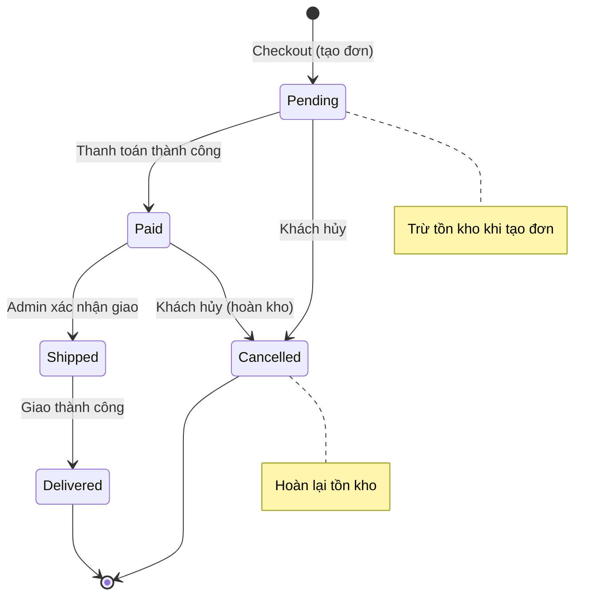
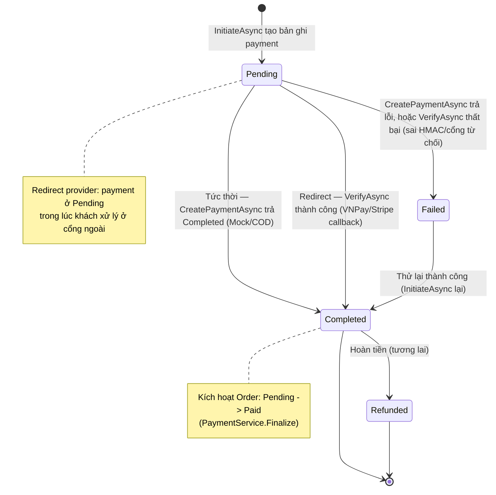

# State Machine Diagrams — MiniShop

## 1. Vòng đời Đơn hàng (Order)

Quy tắc cài đặt trong `Order.ChangeStatus()` (Domain layer). Mọi chuyển trạng thái ngoài các cạnh dưới đây bị từ chối (`InvalidOrderTransitionException` → HTTP 409).

**Bảng chuyển trạng thái hợp lệ:**

| Từ \ Đến | Pending | Paid | Shipped | Delivered | Cancelled |
|----------|:-------:|:----:|:-------:|:---------:|:---------:|
| Pending  | — | ✅ | ❌ | ❌ | ✅ |
| Paid     | ❌ | — | ✅ | ❌ | ✅ |
| Shipped  | ❌ | ❌ | — | ✅ | ❌ |
| Delivered| ❌ | ❌ | ❌ | — | ❌ |
| Cancelled| ❌ | ❌ | ❌ | ❌ | — |

> Delivered và Cancelled là trạng thái cuối (không có cạnh ra).

## 2. Vòng đời Thanh toán (Payment)

Cài đặt trong `PaymentService.InitiateAsync` / `ConfirmAsync` qua `IPaymentProvider` (Mock, COD, VNPay, Stripe). Có 2 kiểu provider:
- **Tức thời** (Mock, COD): `CreatePaymentAsync` trả `Completed = true` ngay trong `InitiateAsync` → không có bước redirect/callback.
- **Redirect** (VNPay, Stripe): `CreatePaymentAsync` trả `RedirectUrl`, payment giữ `Pending` cho tới khi cổng gọi lại `GET /api/payments/{provider}/callback` → `ConfirmAsync` gọi `VerifyAsync` (kiểm tra HMAC-SHA512 với VNPay, hoặc `session_id`/`PaymentStatus` với Stripe) để chốt kết quả.

> `Refunded` được mô hình hóa trong enum cho khả năng mở rộng; luồng hoàn tiền chưa nằm trong phạm vi hiện tại.
