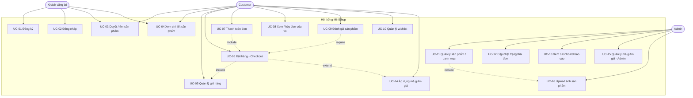

# Use Case Diagram & Đặc tả Use Case — MiniShop

## 1. Sơ đồ Use Case

> Customer kế thừa mọi use case của Guest (đã đăng nhập). Admin có thêm các use case quản trị.
>
> Danh sách đơn hàng (`GET /api/orders`, dùng chung cho UC-08 phía Customer và phần xem đơn trong UC-12 phía Admin) trả kết quả có phân trang (`page`, `pageSize`, mặc định 10, tối đa 100/trang).

---

## 2. Đặc tả Use Case chi tiết

### UC-02: Đăng nhập
| Mục | Nội dung |
|-----|----------|
| **Actor** | Khách / Customer / Admin |
| **Mục tiêu** | Xác thực và nhận JWT |
| **Tiền điều kiện** | Tài khoản tồn tại |
| **Hậu điều kiện** | Client lưu token; các request sau gắn Bearer |
| **Luồng chính** | 1. Người dùng nhập email + mật khẩu. 2. Hệ thống kiểm tra email tồn tại. 3. Verify mật khẩu (BCrypt). 4. Sinh JWT chứa id + role. 5. Trả token + thông tin user. |
| **Luồng thay thế** | 2a/3a. Sai email hoặc mật khẩu → trả 401 "Invalid email or password". |
| **Ngoại lệ** | Lỗi hệ thống → 500 + thông báo chung. |

### UC-05: Quản lý giỏ hàng
| Mục | Nội dung |
|-----|----------|
| **Actor** | Customer |
| **Tiền điều kiện** | Đã đăng nhập |
| **Hậu điều kiện** | Giỏ được cập nhật, tổng tính lại |
| **Luồng chính** | 1. Customer thêm sản phẩm + số lượng. 2. Hệ thống kiểm tra sản phẩm tồn tại. 3. Kiểm tra tồn kho ≥ tổng số lượng. 4. Cộng dồn hoặc tạo item. 5. Lưu, trả giỏ mới. |
| **Luồng thay thế** | 3a. Vượt tồn kho → "Only N in stock". Sửa số lượng ≤ 0 → xóa item. |

### UC-06: Đặt hàng (Checkout)
| Mục | Nội dung |
|-----|----------|
| **Actor** | Customer |
| **Tiền điều kiện** | Giỏ có ít nhất 1 item |
| **Hậu điều kiện** | Đơn tạo ở trạng thái Pending; tồn kho giảm; giỏ rỗng |
| **Luồng chính** | 1. Customer nhập địa chỉ giao. 2. Hệ thống nạp giỏ. 3. Với mỗi item: trừ tồn kho, tạo OrderItem (snapshot tên + giá). 4. Lưu đơn, xóa item giỏ. 5. Trả đơn. |
| **Luồng thay thế** | 2a. Giỏ rỗng → 400. 3a. Tồn kho không đủ → 400, rollback (không lưu). |

### UC-07: Thanh toán đơn (đa cổng: mock / COD / VNPay / Stripe)
| Mục | Nội dung |
|-----|----------|
| **Actor** | Customer |
| **Tiền điều kiện** | Đơn ở trạng thái Pending, thuộc về Customer |
| **Hậu điều kiện** | Payment = Completed; đơn → Paid (tức thì hoặc sau callback) |
| **Luồng chính** | 1. Customer chọn phương thức (mock / cod / vnpay / stripe). 2. Hệ thống lấy `PaymentProviderFactory` resolve provider theo key (không nhận key hợp lệ → fallback `mock`). 3. Gọi `CreatePaymentAsync`. 4a. **Mock / COD**: provider hoàn tất ngay (`Completed = true`) → ghi Payment Completed + transactionId, chuyển đơn Paid, trả `OrderDto`. 4b. **VNPay / Stripe (đã cấu hình key)**: provider trả `RedirectUrl` kèm transactionId tạm, Payment ở trạng thái Pending, API trả `redirectUrl` cho FE chuyển hướng khách sang cổng thanh toán. |
| **Luồng thay thế / callback** | 5. Khách thanh toán xong tại cổng, cổng redirect về `GET /api/payments/{vnpay|stripe}/callback` kèm dữ liệu ký (query params). 6. `ConfirmAsync` gọi `VerifyAsync` để xác thực chữ ký / response code. 7a. Verify thành công → ghi Payment Completed, đơn chuyển Paid, redirect FE `/orders?payment=success`. 7b. Verify thất bại (sai chữ ký, response code ≠ 00, hoặc lỗi) → Payment Failed, đơn giữ nguyên trạng thái, redirect FE `/orders?payment=failed`. |
| **Ngoại lệ** | Cổng từ chối / lỗi khi tạo thanh toán → Payment Failed, đơn giữ Pending, trả 409. Đơn không ở Pending → 409. Không phải chủ đơn → 403. Amount ≤ 0 → lỗi "Invalid amount". Đơn đã Paid khi callback tới muộn → trả kết quả hiện tại, không xử lý lại (idempotent). |
| **Ghi chú** | Khi VNPay/Stripe chưa cấu hình key (`Enabled = false` trong `PaymentOptions`), provider tự fallback sang chế độ demo: hoàn tất thanh toán ngay như mock, không redirect thật, để tiện dev/test. |

### UC-09: Đánh giá sản phẩm
| Mục | Nội dung |
|-----|----------|
| **Actor** | Customer |
| **Tiền điều kiện** | Đã mua sản phẩm (đơn khác Cancelled chứa SP) |
| **Hậu điều kiện** | Review lưu, điểm trung bình SP cập nhật |
| **Luồng chính** | 1. Customer gửi rating 1–5 + nhận xét. 2. Kiểm tra SP tồn tại. 3. Kiểm tra đã mua. 4. Kiểm tra chưa đánh giá. 5. Lưu review. |
| **Luồng thay thế** | 3a. Chưa mua → 403. 4a. Đã đánh giá → 409. Rating ngoài 1–5 → 400. |

### UC-12: Cập nhật trạng thái đơn (Admin)
| Mục | Nội dung |
|-----|----------|
| **Actor** | Admin |
| **Tiền điều kiện** | Đơn tồn tại; chuyển trạng thái hợp lệ |
| **Hậu điều kiện** | Trạng thái đơn cập nhật |
| **Luồng chính** | 1. Admin chọn trạng thái mới. 2. Hệ thống kiểm tra cạnh hợp lệ (state machine). 3. Cập nhật. |
| **Luồng thay thế** | 2a. Chuyển không hợp lệ → 409 "Cannot transition...". |

### UC-13: Xem dashboard (Admin)
| Mục | Nội dung |
|-----|----------|
| **Actor** | Admin |
| **Luồng chính** | 1. Admin mở dashboard. 2. Hệ thống tổng hợp: doanh thu (payment Completed), số đơn, số đơn theo trạng thái, top 5 SP bán chạy. 3. Trả số liệu. |

### UC-14: Áp dụng mã giảm giá (Coupon) khi checkout
| Mục | Nội dung |
|-----|----------|
| **Actor** | Customer |
| **Tiền điều kiện** | Giỏ hàng có ít nhất 1 item; Customer đã đăng nhập |
| **Hậu điều kiện** | Đơn hàng ghi `CouponCode` + `DiscountAmount`; `TimesUsed` của coupon tăng 1 |
| **Luồng chính** | 1. Customer xem trước giảm giá qua `POST /api/coupons/validate` (nhập code + subtotal hiện tại của giỏ) trước khi đặt hàng — hệ thống trả số tiền giảm và tổng sau giảm mà chưa redeem. 2. Customer nhập coupon code trong bước checkout (`CheckoutRequest.CouponCode`). 3. Hệ thống chuẩn hoá code (trim, uppercase), tìm coupon theo `Code`. 4. Kiểm tra `Coupon.IsValidFor(subtotal, now)`: `IsActive = true`, chưa hết hạn (`ExpiresAt`), chưa vượt `MaxUses` (nếu có), `subtotal ≥ MinOrderAmount`. 5. Tính giảm giá qua `CalculateDiscount`: Percentage → `subtotal * Value / 100` (giới hạn không vượt subtotal); FixedAmount → `Value` (giới hạn không vượt subtotal). 6. Gán `order.CouponCode`, `order.DiscountAmount`, gọi `coupon.Redeem()` (tăng `TimesUsed`). 7. Tạo đơn hàng như bình thường (extend UC-06) với tổng đã trừ giảm giá. |
| **Luồng thay thế / ngoại lệ** | 4a. Coupon không tồn tại, không active, đã hết hạn, đã hết lượt dùng, hoặc subtotal chưa đạt `MinOrderAmount` → trả lỗi "Invalid or expired coupon." (400), đơn không được tạo. Không nhập coupon code → checkout diễn ra bình thường, không giảm giá. |

### UC-15: Quản lý mã giảm giá (Admin)
| Mục | Nội dung |
|-----|----------|
| **Actor** | Admin |
| **Tiền điều kiện** | Đã đăng nhập với vai trò Admin |
| **Hậu điều kiện** | Coupon được tạo hoặc xoá trong hệ thống |
| **Luồng chính (Tạo)** | 1. Admin nhập code, loại giảm giá (`Percentage`/`FixedAmount`), giá trị, `MinOrderAmount`, `ExpiresAt` (tuỳ chọn), `MaxUses` (tuỳ chọn). 2. Hệ thống validate: `Value > 0`; nếu `Percentage` thì `Value ≤ 100`; code chưa tồn tại (chuẩn hoá uppercase). 3. Tạo coupon với `IsActive = true`, `TimesUsed = 0`. 4. Lưu, trả `CouponDto`. |
| **Luồng chính (Xem / Xoá)** | 5. `GET /api/coupons` trả danh sách coupon (mới nhất trước). 6. `DELETE /api/coupons/{id}` xoá coupon theo id. |
| **Luồng thay thế / ngoại lệ** | 2a. `Type` không hợp lệ → 400 "Invalid discount type.". 2b. `Value ≤ 0` → 400 "Value must be positive.". 2c. Percentage > 100 → 400 "Percentage cannot exceed 100.". 2d. Code đã tồn tại → 409 "Coupon code already exists.". 6a. Xoá id không tồn tại → 404 "Coupon not found.". |

### UC-16: Upload ảnh sản phẩm (Admin)
| Mục | Nội dung |
|-----|----------|
| **Actor** | Admin |
| **Tiền điều kiện** | Đã đăng nhập với vai trò Admin; đang tạo hoặc sửa sản phẩm (UC-11) |
| **Hậu điều kiện** | File ảnh lưu trên storage; trả về URL công khai để gán vào `ImageUrl` của sản phẩm |
| **Luồng chính** | 1. Admin chọn file ảnh, gửi `POST /api/products/upload-image` (multipart/form-data, giới hạn 5MB qua `RequestSizeLimit`). 2. Hệ thống kiểm tra file tồn tại và không rỗng. 3. `IFileStorage.SaveImageAsync` kiểm tra định dạng (`.jpg`, `.jpeg`, `.png`, `.webp`, `.gif`). 4. Sinh tên file ngẫu nhiên (GUID) giữ nguyên extension, lưu vào thư mục `wwwroot/uploads` (hoặc `Storage:RootPath` cấu hình). 5. Trả về URL công khai (`Storage:PublicPath` + tên file). 6. Admin gán URL này vào field `ImageUrl` khi gọi `POST`/`PUT` sản phẩm (UC-11). |
| **Luồng thay thế / ngoại lệ** | 2a. Không có file hoặc file rỗng → 400 "No file provided.". 3a. Định dạng không được hỗ trợ → lỗi "Unsupported image format.". File vượt 5MB → bị chặn ở tầng request (413/400) trước khi vào action. |
